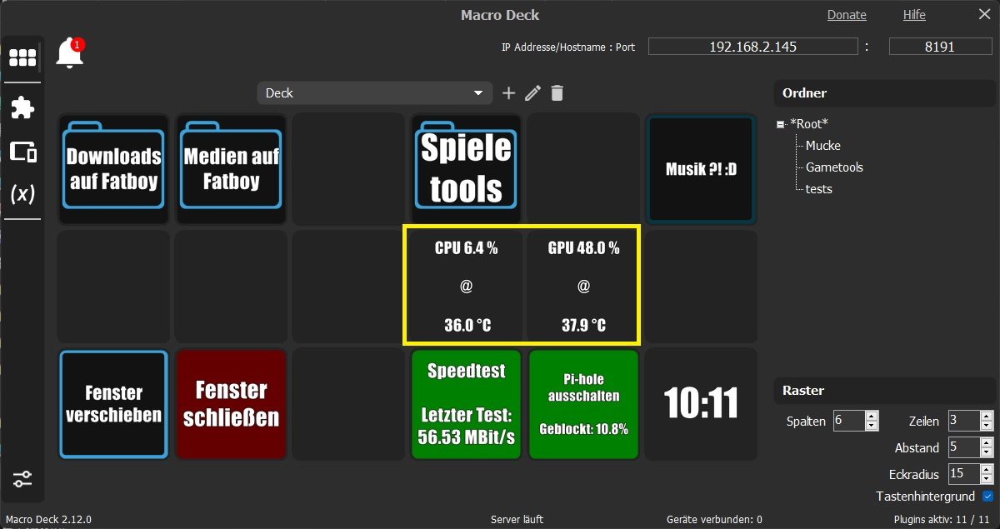

# Ize.HWiNFO64
 Plugin to show system information from HWiNFO64
 
 

Installation:
1. Get latest HWiNFO64 from here: https://www.hwinfo.com/download/
2. Follow the excellent "Setting up HWiNFO" section on how to setup HWiNFO here: https://docs.rainmeter.net/tips/hwinfo/
3. Install the plugin and configure the refresh time for the sensors

Done.
The plugin will now fetch all the sensordata you selected and offer them as variables to use to your liking.
